# 📚 P Study AI

P Study AI is an AI-powered study assistant built using Python, FastAPI, HTML, CSS, and JavaScript.

I built this project during my first semester to improve my Python programming skills and understand how AI APIs can be used in real applications.

This project was developed as a first-semester Python project to apply the concepts I learned and gain practical experience in building AI-powered applications.

The application allows students to upload PDF notes and use AI to study more efficiently by generating summaries, MCQs, explanations, viva questions, flashcards, and study plans.

---

# ✨ Features

- 📄 Upload PDF Notes
- 🤖 Ask AI questions based on uploaded notes
- 📝 Generate AI Summary
- ❓ Generate Multiple Choice Questions (MCQs)
- 📖 Explain Topics
- 🎤 Generate Viva Questions
- 🧠 Generate Flashcards
- 📅 Generate Study Planner
- 📚 Save Conversation History
- 🔍 Search Previous History
- 🗑 Clear History
- ➕ Start New Chat

---

# 🛠️ Technologies Used

## Backend

- Python
- FastAPI
- Groq API
- PyMuPDF

## Frontend

- HTML
- CSS
- JavaScript

---

# 📁 Project Structure

```text
P_STUDY_AI
│
├── app.py
├── index.html
├── style.css
├── script.js
├── requirements.txt
├── README.md
├── .gitignore
├── uploads/
├── history/
├── screenshots/
└── .env
```

---

# 🚀 Installation

### Clone the repository

```bash
git clone https://github.com/your-username/P-Study-AI.git
```

### Go to the project folder

```bash
cd P-Study-AI
```

### Install dependencies

```bash
pip install -r requirements.txt
```

### Add your Groq API Key

Create a `.env` file.

```env
GROQ_API_KEY=your_api_key_here
```

### Run the application

```bash
python app.py
```

### Open your browser

```
http://127.0.0.1:8000
```

---

# 📸 Application Screenshots

## 1. Home Page

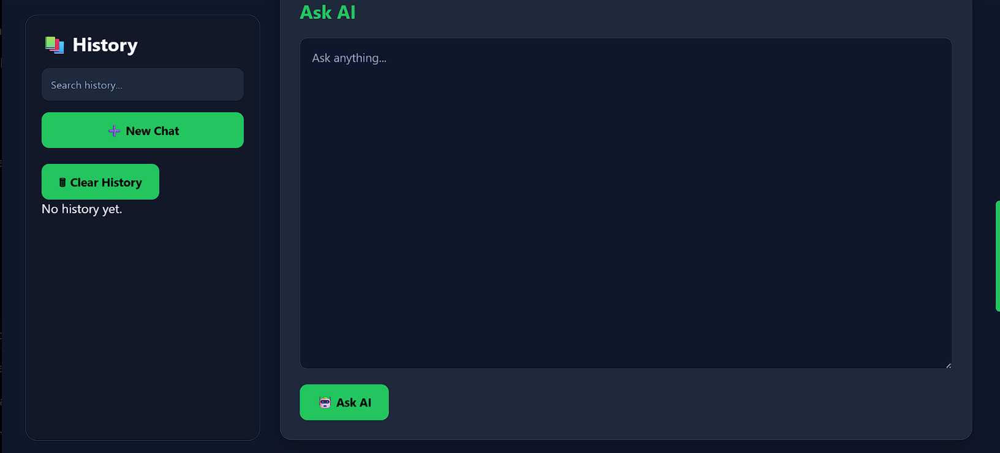

---

## 2. Upload PDF

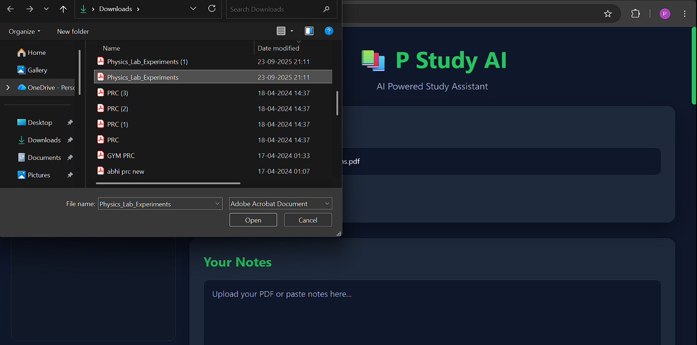

---

## 3. Notes Loaded

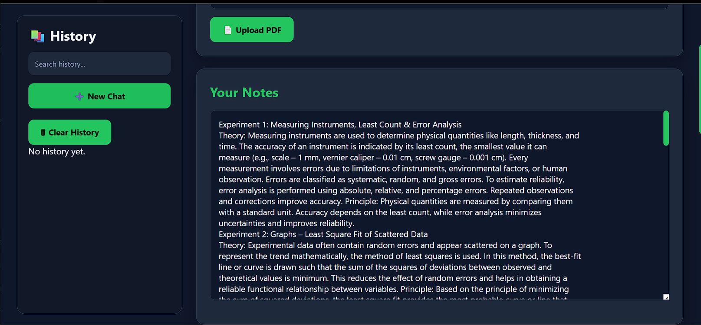

---

## 4. Ask AI

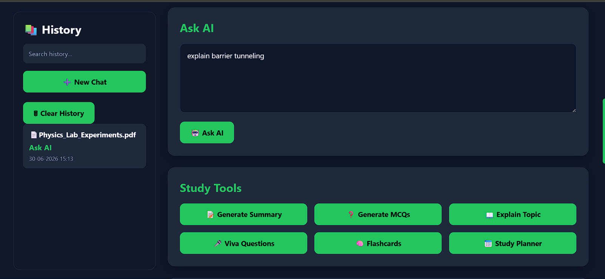

---

## 5. AI Response

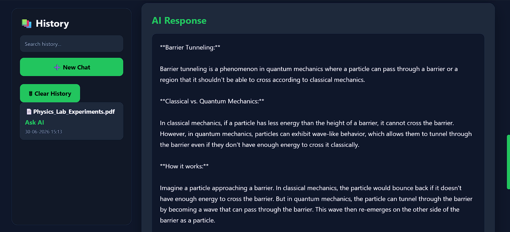

---

## 6. Generate Summary

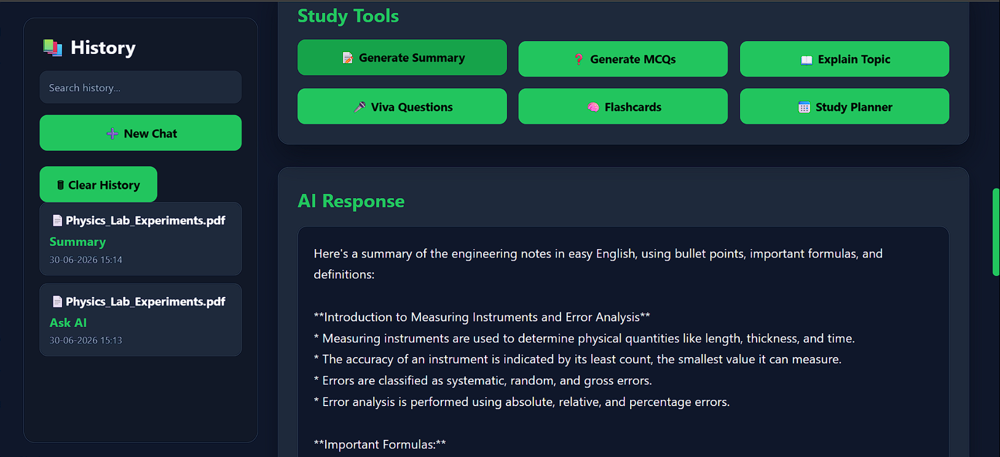

---

## 7. Generate MCQs

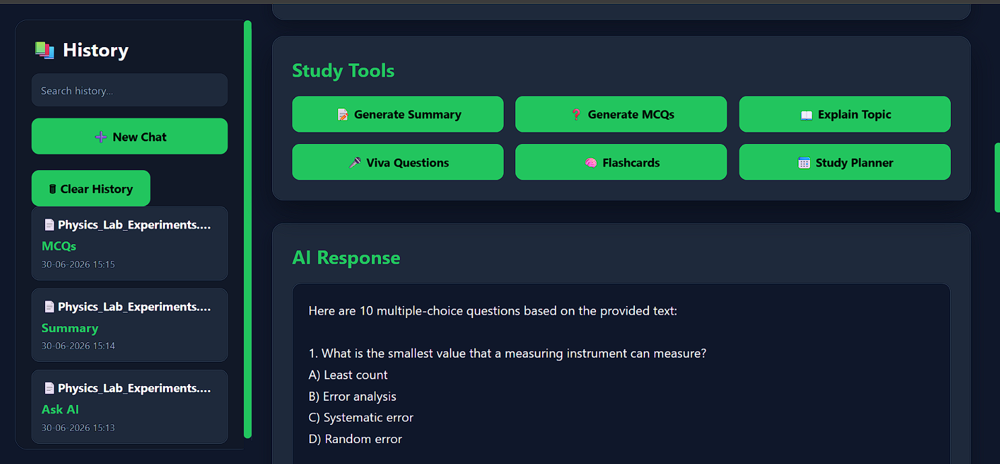

---

## 8. Explain Topic


---

## 9. Viva Questions

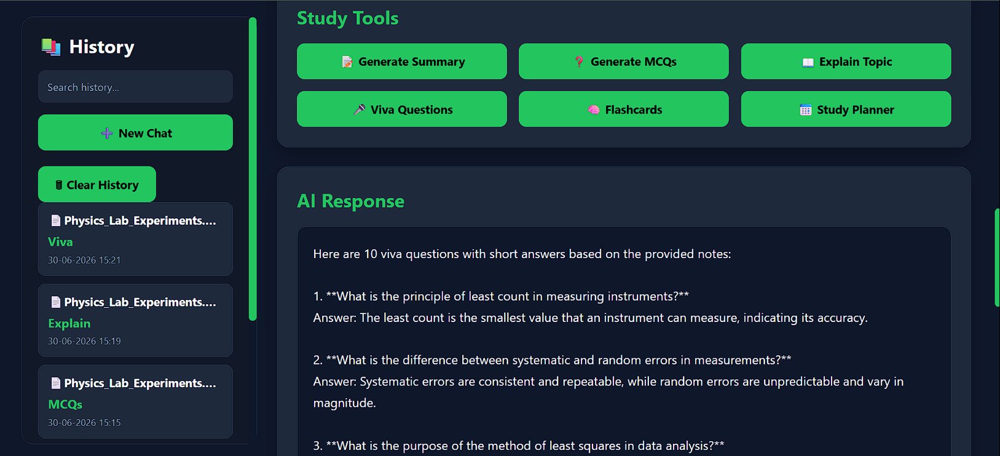

---

## 10. Flashcards

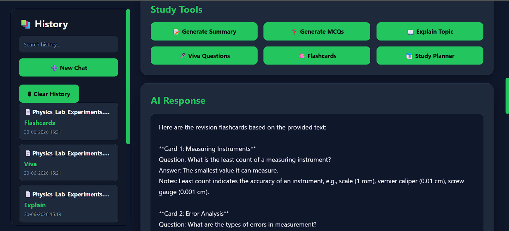

---

## 11. Study Planner


---

## 12. History

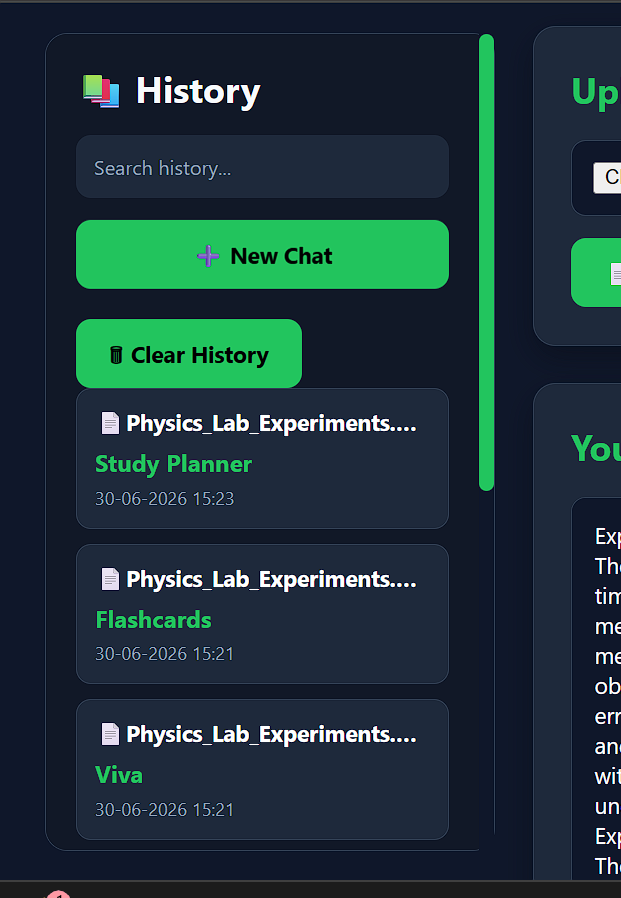

---

## 13. New Chat

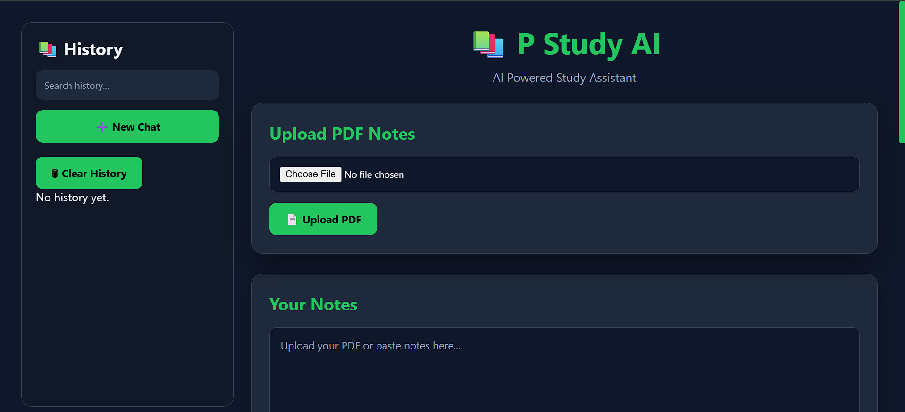

---

# 📖 What I Learned

While building this project, I learned:

- Python programming
- FastAPI fundamentals
- REST API development
- Working with PDF files using PyMuPDF
- AI API integration using Groq
- JSON data handling
- Frontend and backend communication
- JavaScript Fetch API
- Project structure and organization
- Debugging and problem-solving

This project significantly improved my understanding of Python development and how AI APIs can be integrated into real-world applications.

---

# 🔮 Future Improvements

Some features I would like to add in the future:

- User Authentication
- Database Integration
- Cloud Deployment
- Responsive Mobile UI
- AI Chat Memory
- Dark / Light Theme
- Export Notes
- Multi-PDF Support

---

# 👨‍💻 Author

**Prabhudev Naik**

B.Tech Computer Science Engineering (Artificial Intelligence & Machine Learning)

This project was developed as a first-semester Python project to strengthen my Python programming skills and gain practical experience in building AI-powered applications.

---

# 📄 License

Copyright © 2026 Prabhudev Naik

This project is shared for educational and portfolio purposes. Please do not copy, redistribute, or present this work as your own.